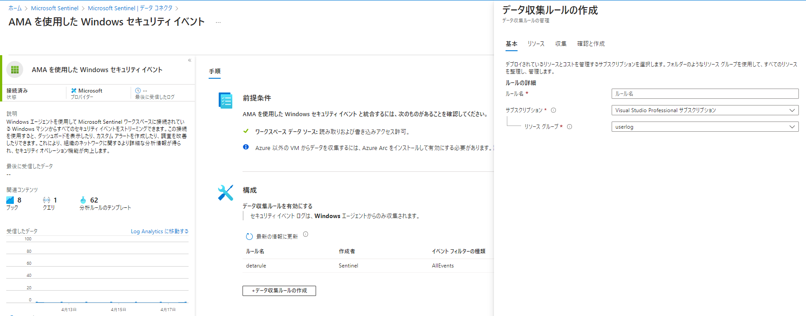

# Azure Log Analytics with Azure Monitor Agent by using Microsoft Sentinel
This guide details how to set up an Azure Monitor Agent by using Microsoft Sentinel to collect ECX log files from on-premises Windows server nodes, monitor them for error events. 
Note that since the legacy Log Analytics agent will be deprecated by August 2024, the Azure Monitor agent is used here. 
This guide details how to set this up for ECX VM nodes in an on-premises environment.

## 1. Activate Microsoft Sentinel
Search for and select Microsoft Sentinel.
Select a workspace to use or create a new workspace.

## 2. Select "Windows Security Events with AMA" from Data Connectors
A Data connectors specify how data is ingested into Microsoft Sentinel.
Select "Windows Security Events with AMA" from Data Connectors　from the Sentinel Data Connector. 

## 3. Create data collection rules
A Data Collection Rule will define the data collection process in Azure Monitor. It specifies what will be collected, where to send the data, and how it will be transformed. 

## 4. Install AMA & select target VM for log collection
Select the VMs where you want to deploy the Azure Monitor agent.

## 5. Select the type of Windows Security Event log
Depending on the application, you can select the content of the event to be acquired.
Please refer to the [official document](https://learn.microsoft.com/ja-jp/azure/sentinel/windows-security-event-id-reference) for details.

## 6. Create
